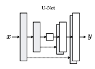
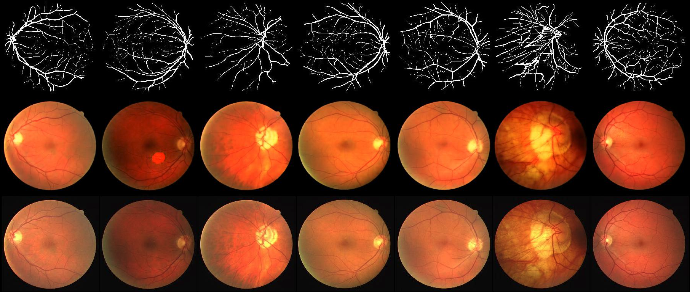

# Pix2pix Implement

#### Title
[Image-to-Image Translation with Conditional Adversarial Networks](https://arxiv.org/abs/1611.07004)

 

## Pix2pix with PyTorch

## Requirment
- Python                 3.7+
- torch                  1.7.1+cu110
- torchvision            0.8.2+cu110
- matplotlib             3.3.3
- numpy                  1.19.5
- Pillow                 8.1.0
- scikit-image           0.17.2
- scipy                  1.5.4
- tensorboard            2.4.1
- tensorboardX           2.1

## Train

    $ python main.py --mode train 
                     --data_path data/facades \
                     --ckpt_path ckpt/facades \
                     --result_path result/facades \
                     --gpu 0
---

* Set your data_path, ckpt_path, and result_path.
* Hyperparameters were written to **arg.txt** under the **[log directory]**.

## Test
    $ python main.py --mode test 
                     --ckpt_path ckpt/monet2photo \
                     --result_path result/monet2photo \
                     --gpu 0
---

* To test using trained network, set **ckpt_path** defined in the **train** phase.
* Generated images are saved in the **images** subfolder along with **[result directory]** folder.

## Results
  

    1st row: input  - Vessel segmentation map 
    2nd row: output - Fake Fundus Photo
    3th row: input  - real Fundus Photo

## Directories structure

    [dataset name]
    +---[Executable code]   - (Github code)
    |   +---main.py
    |   |   ...
    |   +---utils.py 
    \---[root]              - (Result)
        +---data
        |   +---[data_name1]
        |   |   +---train
        |   |   |   +---0000.jpg
        |   |   |   |   ...
        |   |   |   \---1234.jpg
        |   |   +---val
        |   |   |   +---0000.jpg
        |   |   |   |   ...
        |   |   |   \---1234.jpg
        |   |   +---test
        |   |   |   +---0000.jpg
        |   |   |   |   ...
        |   |   |   \---1234.jpg
        |   \---[data_name2]
        |       |   ...
        +---ckpt
        |   +---[data_name1]
        |   |   +---model_epoch0000.pth
        |   |   |   ...
        |   |   \---model_epoch1234.pth
        |   \---[data_name2]
        |       +   ...
        +---result
        |   +---[data_name1]
        |   |   +---sample0000.jpg
        |   |   |   ...
        |   |   \---sample1234.jpg
        |   \---[data_name2]
        |       |   ...
        \---result_test
            +---[data_name1]
            |   +---sample0000.jpg
            |   |   ...
            |   \---sample1234.jpg
            \---[data_name2]
                |   ...

                
